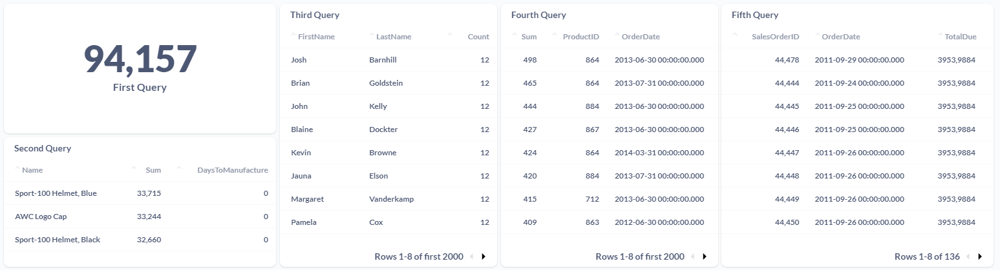

# Rox-Challenge

Welcome to My Rox Challenge!

This documentation explains a lit bit of the ETL functionality, how to run it, the moddeling process and the dashboard with the requested queries.

## Table of Contents

- [Commands](#commands)
- [Modelling](#modelling)
- [Dashboard](#dashboard)

## Commands

Commands to utilize and help the developing process:

1. **Requirements:**
  - `make requirements`: installs all packages from all requirements files

2. **Lint:**
  - `make apply-style`: runs `black` and `isort` lint checks
  - `make quality-check`: runs check of code style using `flake8`
  - `make style-check`: runs check of code style using `black`

3. **Documentation:**

 First step use this command to install the basic requirements:
  ```bash
  make requirements
  ```
  
  Then create docker containers using 
  ```bash
  make up
  ```

  For this challenge, considering the time I had and knowing that the data was small and few, I decided to use a simpler architecture.
  
  Here I used a local PostgreSQL database as a warehouse, DBT for data modeling and a Metabase instance for further analysis.
  
  
  
  Ideally, a more robust architecture should be built with a cloud, such as AWS S3 for the lake and Redshift for the data warehouse.

  Now run the following command line to create the tables from csv files into a postgressql database:
  ```bash
  python -m rox_challenge.etl_cli
  ```

  After that, we are going to use DBT to generate the models. 

 ```bash
  dbt run 
  ```

## Modelling

In this case, as the data and queries are simple, I chose to do a simple modeling, just going through the staging process.
But thinking about a more complex work scenario, the ideal would be to create intermediate and mart layers, as recommended by DBT.

## Dashboard

 The dashboard answers to the queries requested by the challenge
 
 

The queries made:

 - First:
 ```sql
   with Count_Order as (
    select
        count("SalesOrderDetailID") as SalesOrderID_Count,
        "SalesOrderID"
    from "dbt_schema"."stg_SalesOrderDetail"
    group by "SalesOrderID"
    Having count("SalesOrderDetailID") >=3
)
select sum(SalesOrderID_Count) from Count_Order
  ```
  
  - Second:
 ```sql
   select 
    "stg_Product"."Name",
    SUM("stg_SalesOrderDetail"."OrderQty"),
    "stg_Product"."DaysToManufacture"

from "dbt_schema"."stg_SalesOrderDetail"
join "dbt_schema"."stg_SpecialOfferProduct" on "stg_SalesOrderDetail"."ProductID" = "stg_SpecialOfferProduct"."ProductID"
join "dbt_schema"."stg_Product" on "stg_SalesOrderDetail"."ProductID" = "stg_Product"."ProductID"
group by "stg_Product"."Name","stg_Product"."DaysToManufacture"
order by sum("stg_SalesOrderDetail"."OrderQty") desc
limit 3
  ```
  
  - Third:
 ```sql
   select 
    "stg_Person"."FirstName",
    "stg_Person"."LastName",
    count("stg_SalesOrderHeader"."PurchaseOrderNumber")

from "dbt_schema"."stg_Customer"
join "dbt_schema"."stg_Person" on "stg_Customer"."PersonID" = "stg_Person"."BusinessEntityID"
join "dbt_schema"."stg_SalesOrderHeader" on "stg_Customer"."CustomerID" = "stg_SalesOrderHeader"."CustomerID"
group by "stg_Person"."FirstName", "stg_Person"."LastName"
order by count("stg_SalesOrderHeader"."PurchaseOrderNumber") desc
  ```
  
  - Fourth:
 ```sql
   select 
    sum("stg_SalesOrderDetail"."OrderQty"),
    "stg_Product"."ProductID",
    "stg_SalesOrderHeader"."OrderDate"

from "dbt_schema"."stg_SalesOrderDetail"
join "dbt_schema"."stg_SalesOrderHeader" on "stg_SalesOrderDetail"."SalesOrderID" = "stg_SalesOrderHeader"."SalesOrderID"
join "dbt_schema"."stg_Product" on "stg_SalesOrderDetail"."ProductID" = "stg_Product"."ProductID"
group by "stg_Product"."ProductID", "stg_SalesOrderHeader"."OrderDate"
order by sum("stg_SalesOrderDetail"."OrderQty") desc
  ```
  
  - Fifth:
 ```sql
   select 
    "stg_SalesOrderHeader"."SalesOrderID",
    "stg_SalesOrderHeader"."OrderDate",
    "stg_SalesOrderHeader"."TotalDue"

from "dbt_schema"."stg_SalesOrderHeader"
where REPLACE("stg_SalesOrderHeader"."TotalDue", ',' , '.')::float > 1000
and "stg_SalesOrderHeader"."OrderDate" between '2011-09-01' and '2011-09-30'
order by "stg_SalesOrderHeader"."TotalDue" desc
  ```
  
  That's all for now, thanks!
